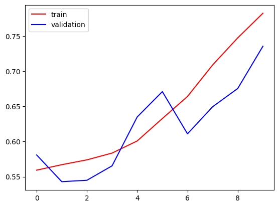
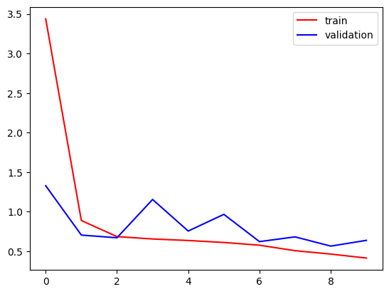

# Cats vs Dogs Image Classification using CNN

This project implements a **Convolutional Neural Network (CNN)** to classify images of **cats and dogs**.  
The model is trained on labeled image data and learns visual patterns such as edges, textures, and shapes to make accurate predictions.

---

## Project Overview

- **Task:** Binary image classification (Cat vs Dog)
- **Approach:** Deep Learning using CNN
- **Framework:** TensorFlow / Keras
- **Platform:** Google Colab

---

## Model Architecture

The CNN architecture consists of:
- Convolutional layers for feature extraction
- MaxPooling layers for spatial downsampling
- Fully connected (Dense) layers for classification
- Sigmoid activation for binary output

---

## 📊 Dataset

- The dataset contains images of cats and dogs
- Images are resized and normalized before training
- Data augmentation is applied to improve generalization

> Dataset source can be Kaggle or any standard Cats vs Dogs dataset. I used this [Dataset](https://www.kaggle.com/datasets/d4rklucif3r/cat-and-dogs)

---

## How It Works

- Load and preprocess image data
- Build CNN model
- Train the model on training data
- Evaluate performance on validation data

## Results

- Achieves **73.55%** accuracy on validation data

#### Accuracy

#### Loss

> Model performance depends on dataset size and training epochs